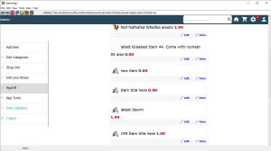
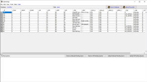

<table style="margin: 0 auto; max-width: 900px" align="center">
	<tr>
		<td>
<strong>- About:</strong> evenflow is an abstract attempt to use the javafx 
browser, LAMP stack and android to deploy and maintain simple desktop,web,mobile applications.  
		Emphasis is on e-commerce software components and how they can be 
		integrated to work together with minimal maintenance. A working
		<strong>demo</strong> can be currently found here:
		<a href="http:///quickorder.eu5.net">http:///quickorder.eu5.net</a> 
		

<strong>- Quick Setup:</strong> upload the whole project or the 
<a href="webdroid/assets/quickorder">webdroid/assets/quickorder</a> folder to your web 
site. create a mysql database 
named evenflow. open <a href="browser/db_schema.txt">browser/db_schema.txt</a> and import it to your database. 
open<a href="webdroid/assets/quickorder/_p/do.php"> quickorder/_p/do.php</a> and edit the dbusername and password variables. 
point your native web browser to http://...assets/quickorder/index.html 
<a href="webdroid/bin/b.bat">build</a> and or 
<a href="webdroid/bin/i.bat">install</a> the
<a href="webdroid/bin/QuickOrder-debug.apk">android app apk</a>. 
in the browser/ folder <a href="browser">launch</a> the adminApp browser app.  <strong>- Build:</strong> the build 
folder is boil/ the javafx, android app and web page compression are done from 
command line. See <a href="boil">boil/README.txt</a>  

		
<strong>- Structure: </strong>/boil [builld folder] /browser [main 
		javafx browser app with spreadsheet 
panel] 
/webdroid [android app] /webdroid/assets/quickorder [android app content and 
e-commerce webpage] 
		 - <strong>Javascript 
to Java Interface Bridge:</strong> 
evenflow javafx browser and android app rely heavily onthe JSI_ javascript 
inerface files to interact with the WebViews, etc. See using the javafx 
browser AppDB links on the webpage while running the javafx app for example. 
Pages such as edit or view category will show the AppDB clickable link on left 
that will swap browser panel to editable spreadsheet style panel.  
  - <strong>User Interface:</strong> 
Rendering of the user interface mostly relies on simple html and javascript, json.  <strong>- Database:</strong> Import 
		the db_schema.txt file found in browser/ folder to your database. See 
		webdroid/README.txt for info on interacting with your database. 
 - <strong>
WorkFlow:</strong> webdroid/assets is your e-commerce webpage. you can build 
it directly to your android app. Your android app enhances your e-commerce 
webpage with camera and speech capabilites among others. The javafx broser 
enhances your e-commerce web page with spreadsheet capablities.  
<strong>- Changes:</strong> Feb 30, 2019 -&nbsp; boil/ folder added 
containing pages-scrips-classes to clean and build evenflow project.- -&nbsp; 
adminApp jar file added. read&nbsp; browser/README for more info. -.. 
adminApp javafx browser made more user friendly. -&nbsp; README.txt files 
added to most main project folders. [READ THEM. it may save you tons of time] 
-&nbsp; android main package changed to com.quickorder  
		Nov 19, 2019 -&nbsp; have been made: the main file was index.php, but due to 
incompatibility issues with androids webview, it has been renamed to index.html. 
See the .htaccess file on how AddHandler is used to parse .html extension in 
php. You can also change your actual php.ini file to do this, but requires more 
steps. - material icon html tags converted to use numeric reference 
(compatibility with javafx browser
<a href="webdroid/assets/quickorder/fonts/materialicons/numerical_vhar_ref.txt">
see reference here</a>).  - <strong>
TODO:</strong> 
clean up and comment code. clean up the UI. 
 - <strong>
Credits:</strong> 
Most of the credits for open sourced code that is used in this app is usually 
included in the code. If you 
deserve some credit, let us know.  

		</td>
	</tr>
</table>
